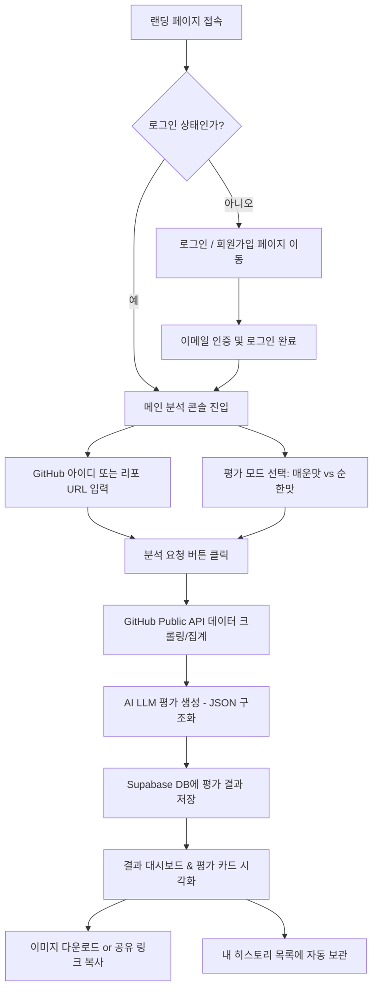

# [PRD] GitRoast (깃-로스트) - GitHub 계정 및 리포지토리 분석·평가 서비스

---

## 1. 개요 (Overview)

### 1.1 서비스 소개
**GitRoast**는 개발자의 GitHub 사용자명(Username) 또는 특정 리포지토리(Repository) 주소를 입력하면, 공개된 활동 데이터(커밋 주기, 잔디 현황, 언어 분포, 스타 수, README 완성도 등)를 수집하여 AI가 유쾌하고 날카로운 **[매운맛 팩폭(Roast)]** 또는 실용적인 **[순한맛 커리어 피드백(Review)]**을 제공하는 웹 서비스입니다.

### 1.2 문제 정의 (Problem Statement)
- **딱딱하고 지루한 프로필 분석**: 기존 개발자 분석 도구는 복잡한 수치와 그래프만 나열되어 재미가 없고 공유 유인이 적습니다.
- **객관적인 제3자의 피드백 부족**: 개발자들은 자신의 깃허브 관리 상태(커밋 메시지 규칙, 문서화 수준, 리포지토리 관리)가 남들에게 어떻게 보이는지 궁금해하지만, 솔직한 피드백을 받기 어렵습니다.
- **SNS 바이럴 및 동기부여 부재**: 친구, 동료 개발자와 재미있게 공유하고 경쟁할 수 있는 가벼운 엔터테인먼트형 분석 콘텐츠가 부족합니다.

### 1.3 제품 목표 (Goal)
- 사용자가 10초 만에 본인 또는 동료의 깃허브를 진단하고 한눈에 들어오는 **'평가 카드'**를 얻을 수 있게 합니다.
- **Supabase 인증**을 통해 가입된 사용자만 분석을 수행하고, 과거 평가 히스토리를 언제든 다시 열람할 수 있도록 안전하게 저장합니다.
- 모바일/웹 어디서든 시각적으로 돋보이는 카드 UI를 제공하여 SNS 공유 및 바이럴을 유도합니다.

---

## 2. 타깃 사용자 & 페르소나 (Target Audience)

1. **주니어 개발자 & 취업 준비생**: 
   - 내 깃허브가 채용 담당자나 다른 사람 눈에 어떻게 보이는지 진단받고, 개선 포인트를 찾고 싶은 사람.
2. **동료와 재미를 나누고 싶은 현업 개발자**: 
   - 동료 깃허브를 분석해 단톡방에 공유하며 웃고 떠들거나, 본인의 커밋 내역을 유쾌하게 자조(Roast)하고 싶은 사람.
3. **IT 동아리 / 부트캠프 수강생**: 
   - 서로의 깃허브 잔디 상태를 비교하고 학습 동기부여를 얻고자 하는 사용자.

---

## 3. 핵심 기능 명세 (Core Features - MVP Scope)

### 3.1 GitHub 공개 데이터 자동 수집
- **입력 지원**: 
  - GitHub 사용자명 (예: `torvalds`)
  - 특정 리포지토리 URL 또는 형식 (예: `facebook/react` 또는 `https://github.com/facebook/react`)
- **수집 데이터 항목**:
  - 사용자 기본 정보 (프로필 소개, 팔로워/팔로잉, 공개 리포지토리 수)
  - 최근 커밋 활동성 (잔디 연속 커밋 일수, 최근 30일 커밋 빈도, 커밋 메시지 패턴)
  - 주력 프로그래밍 언어 분포 (Top 3~5 언어 비율)
  - 주요 리포지토리 상태 (스타 수, 포크 수, README.md 존재 여부 및 길이)

### 3.2 듀얼 AI 평가 모드 (Dual Evaluation Modes)
사용자가 분석 실행 전 원하는 모드를 토글(Toggle) 형태로 선택:
1. 🔥 **매운맛 팩폭 모드 (Roast Mode)**:
   - 신랄한 풍자와 위트 있는 비유로 깃허브 상태를 디스
   - 주요 항목:
     - 개발자 생존 등급 티어: `SSS`, `SS`, `S`, `A`, `B`, `C`, `D`, `F`
     - 촌철살인 한줄평 (예: *"최근 커밋 메시지의 80%가 'fix', '제발'. 잔디밭이 아니라 참회의 기도실이네요."*)
     - 대표 치명적 결함 3가지
     - AI가 판정한 가상 위험도 지수
2. 💼 **순한맛 커리어 피드백 모드 (Tech Career Review Mode)**:
   - 채용 담당자 및 시니어 개발자 관점의 건설적인 조언
   - 주요 항목:
     - 종합 역량 평가 점수 (100점 만점) 및 레이더 차트 수치
     - 돋보이는 강점 및 프로젝트 매력도
     - 구체적인 개선 제안 3가지 (예: README에 프로젝트 아키텍처 다이어그램 추가 권장, 커밋 컨벤션 도입 제안 등)

### 3.3 시각화 평가 카드 & 공유
- **결과 카드 컴포넌트**: 
  - 깃허브 프로필 사진, 닉네임, 티어 뱃지, 핵심 코멘트, 레이더 차트 등이 포함된 감각적인 카드 UI.
- **이미지 다운로드**: `html-to-image` 기반으로 평가 결과를 고화질 PNG 이미지로 원클릭 저장.
- **공유 링크**: 고유 URL을 생성하여 로그인 없이도 특정 평가 결과 카드 열람 가능 (Open Graph 메타태그 적용으로 카카오톡/트위터 미리보기 지원).

### 3.4 사용자 인증 및 히스토리 관리 (Supabase Auth & Database)
- **접근 제한**: 비로그인 사용자는 서비스 소개 및 예시 카드는 열람 가능하나, 실제 새 분석 요청은 **회원가입/로그인 후 이용 가능**.
- **인증 방식**: 이메일/비밀번호 기반 회원가입 (이메일 인증 포함) + 추후 소셜 로그인 확장 가능한 구조.
- **내 평가 히스토리**: 내가 과거에 조회했던 평가 결과들을 대시보드에서 목록 형태로 재확인하고 즐겨찾기(Bookmark) 가능.

---

## 4. MVP 제외 범위 (Out of Scope for MVP)

- 유료 구독 및 크레딧 결제 시스템 (현재는 일일 생성 횟수 제한 기반 무료 운영)
- GitHub OAuth 권한 획득을 통한 비공개(Private) 리포지토리 분석
- 조직(Organization) 단위 대규모 팀 분석 대시보드
- 실시간 1:1 대화형 챗봇 형태의 질의응답 (단방향 정밀 리포트 생성에 집중)

---

## 5. 사용자 플로우 (User Journey Flow)

---

## 6. 성공 지표 (Key Success Metrics)

- **가입 전환율**: 랜딩 페이지 방문 대비 회원가입 전환율 30% 이상
- **분석 완료율**: 검색 입력 후 평가 카드 생성 성공률 98% 이상 (API Rate Limit 및 유효하지 않은 아이디 방어)
- **카드 공유/다운로드율**: 평가 완료 사용자 중 25% 이상이 이미지 다운로드 또는 공유 링크 생성
