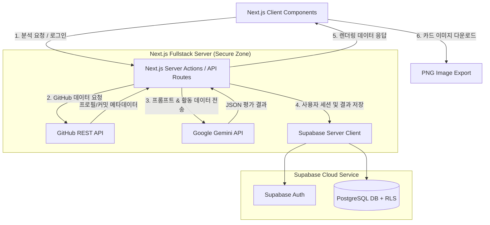

# [기술명세서] GitRoast - 아키텍처, 스택 비교 및 보안 설계 (TECH_SPEC)

---

## 1. 기술 스택 비교 및 최종 선정 (Tech Stack Comparison)

노션 가이드라인에 따라 후보 기술 스택의 장단점을 종합 분석하고 최적의 스택을 선정합니다.

### 1.1 프론트엔드 & 풀스택 프레임워크 비교

| 후보군 | 장점 (Pros) | 단점 (Cons) | 적합도 |
| :--- | :--- | :--- | :--- |
| **A. Next.js 14+ (App Router)** | • **서버 사이드 키 은닉**: Server Actions 및 API Route를 통해 Supabase Service Role Key, Gemini API Key, GitHub Token이 클라이언트에 100% 노출되지 않음.<br>• **동적 OG 이미지 지원**: 평가 결과 카드별 동적 메타태그(카카오톡/SNS 미리보기) 구현이 매우 쉬움.<br>• **Vercel 원클릭 배포**: 배포 및 환경변수 관리가 극히 간편함. | • React Server Component(RSC) 개념 이해 필요. | **최우수 (선정)** 🏆 |
| **B. Vite (React) + Express/FastAPI 분리형** | • 프론트와 백엔드의 관심사 분리가 명확함.<br>• 로컬 빌드 및 HMR 속도가 매우 빠름. | • 프론트엔드와 백엔드 서버를 각각 따로 호스팅/배포해야 하므로 배포 및 CORS 관리가 복잡해짐.<br>• 클라이언트 사이드 렌더링(CSR) 특성상 SNS 링크 공유 시 동적 메타태그 적용이 까다로움. | 보통 |
| **C. SvelteKit / Nuxt** | • 가볍고 반응성이 뛰어남.<br>• 보일러플레이트 코드가 적음. | • shadcn/ui 등 풍부한 React 생태계의 완성도 높은 디자인 시스템 활용 제한.<br>• LLM/AI SDK 관련 커뮤니티 지원이 React 대비 적음. | 보통 |

### 1.2 최종 확정 기술 스택

- **프레임워크**: **Next.js 14+ (TypeScript, App Router)**
- **스타일링 & UI**: **Tailwind CSS + shadcn/ui + Lucide Icons + Recharts** (레이더 차트 시각화)
- **카드 이미지 변환**: **html-to-image** (클라이언트 사이드 고해상도 PNG 변환)
- **백엔드 & BaaS**: **Supabase** (PostgreSQL, Supabase Auth, Row Level Security)
- **AI 엔진**: **Google Gemini 2.0 Flash / 1.5 Flash** (`@google/genai` or official SDK)
- **데이터 소스**: **GitHub REST API v3** (Octokit / Fetch API)
- **배포 환경**: **Vercel** (프론트/서버리스) + **Supabase Cloud** (DB/Auth)

---

## 2. 시스템 아키텍처 (System Architecture)



---

## 3. 데이터베이스 스키마 및 RLS 설계 (Database & Security)

### 3.1 테이블 정의 (DDL)

```sql
-- 1. 사용자 프로필 테이블 (Supabase Auth와 1:1 매핑)
CREATE TABLE public.profiles (
    id UUID PRIMARY KEY REFERENCES auth.users(id) ON DELETE CASCADE,
    email TEXT NOT NULL,
    nickname TEXT,
    created_at TIMESTAMPTZ DEFAULT TIMEZONE('utc'::text, NOW()) NOT NULL
);

-- 2. 평가 결과 저장 테이블
CREATE TABLE public.evaluations (
    id UUID PRIMARY KEY DEFAULT gen_random_uuid(),
    user_id UUID NOT NULL REFERENCES public.profiles(id) ON DELETE CASCADE,
    target_type TEXT NOT NULL CHECK (target_type IN ('user', 'repo')),
    target_name TEXT NOT NULL, -- e.g. "torvalds" or "facebook/react"
    mode TEXT NOT NULL CHECK (mode IN ('roast', 'review')),
    tier TEXT NOT NULL, -- "SSS", "S", "A", "B", "C", "D", "F"
    score INTEGER NOT NULL CHECK (score >= 0 AND score <= 100),
    one_liner TEXT NOT NULL,
    details JSONB NOT NULL, -- radar scores, flaws, strengths, suggestions
    raw_github_summary JSONB, -- 커밋 수, 언어 비율 등 당시 수집 요약
    is_public BOOLEAN DEFAULT true NOT NULL,
    created_at TIMESTAMPTZ DEFAULT TIMEZONE('utc'::text, NOW()) NOT NULL
);

-- 3. 즐겨찾기 테이블
CREATE TABLE public.favorites (
    id UUID PRIMARY KEY DEFAULT gen_random_uuid(),
    user_id UUID NOT NULL REFERENCES public.profiles(id) ON DELETE CASCADE,
    evaluation_id UUID NOT NULL REFERENCES public.evaluations(id) ON DELETE CASCADE,
    created_at TIMESTAMPTZ DEFAULT TIMEZONE('utc'::text, NOW()) NOT NULL,
    UNIQUE(user_id, evaluation_id)
);
```

### 3.2 행 수준 보안 정책 (Row Level Security - RLS)

> 노션 지침: 모든 테이블에 RLS를 켜고 안전한 접근 권한만 개방합니다.

```sql
-- RLS 활성화
ALTER TABLE public.profiles ENABLE ROW LEVEL SECURITY;
ALTER TABLE public.evaluations ENABLE ROW LEVEL SECURITY;
ALTER TABLE public.favorites ENABLE ROW LEVEL SECURITY;

-- 1. profiles 정책
CREATE POLICY "본인 프로필만 조회 가능" 
    ON public.profiles FOR SELECT 
    USING (auth.uid() = id);

CREATE POLICY "본인 프로필만 수정 가능" 
    ON public.profiles FOR UPDATE 
    USING (auth.uid() = id);

-- 2. evaluations 정책
-- 생성은 로그인된 본인만 가능
CREATE POLICY "로그인 사용자 평가 생성 가능" 
    ON public.evaluations FOR INSERT 
    WITH CHECK (auth.uid() = user_id);

-- 조회의 경우: 본인이 생성했거나, is_public=true인 공유 카드는 누구나(비로그인 포함) 조회 가능
CREATE POLICY "본인 소유 또는 공개 평가 조회 가능" 
    ON public.evaluations FOR SELECT 
    USING (auth.uid() = user_id OR is_public = true);

-- 수정 및 삭제는 작성자 본인만 가능
CREATE POLICY "작성자 본인만 평가 삭제 가능" 
    ON public.evaluations FOR DELETE 
    USING (auth.uid() = user_id);

-- 3. favorites 정책
CREATE POLICY "본인 즐겨찾기만 조회 가능" 
    ON public.favorites FOR SELECT 
    USING (auth.uid() = user_id);

CREATE POLICY "본인 즐겨찾기만 추가/삭제 가능" 
    ON public.favorites FOR ALL 
    USING (auth.uid() = user_id);
```

---

## 4. Supabase 8대 사전 보안 체크리스트 연동 설계 (노션 필수 준수)

노션 문서에 지정된 8대 보안 수칙을 기술 아키텍처에 100% 반영합니다.

1. **비밀 키·토큰 재발급과 서버 전용 보관**:
   - `NEXT_PUBLIC_SUPABASE_ANON_KEY`: 클라이언트에 노출되는 키로, 오직 RLS 정책 하에서만 쿼리 동작.
   - `SUPABASE_SERVICE_ROLE_KEY`: 관리자 권한 키로, 절대 `NEXT_PUBLIC_` 접두사를 붙이지 않고 서버 사이드(Next.js Route Handler / Server Action)에서만 환경변수 로드.
   - `GEMINI_API_KEY`, `GITHUB_PAT_TOKEN`: 서버 전용 `.env.local` 보관. 만약 깃허브 등에 유출 감지 시 즉시 폐기 및 재발급.
2. **이메일 확인 켜기 + 커스텀 SMTP 연동**:
   - Supabase Auth 설정에서 `Confirm email`을 필수로 활성화하여 임의 이메일 무제한 생성 방지.
   - 기본 내장 메일러 대신 Resend / SendGrid SMTP 연결 가이드 제공.
3. **비밀번호 정책과 유출 검사**:
   - Supabase Auth 대시보드에서 `Enforce password policy` 활성화 (최소 8자, 숫자/특수문자 포함).
   - HaveIBeenPwned API 연동 유출 비밀번호 자동 차단 옵션 활성화.
4. **남용 방어 (Rate Limiting & Abuse Prevention)**:
   - 클라이언트 IP 및 사용자 계정당 1분당 최대 5회, 일일 최대 30회 분석 요청 제한 (Next.js Server Middleware 적용).
   - 회원가입 페이지에 Cloudflare Turnstile 또는 hCaptcha 적용 지점 마련.
5. **접근 제어 재점검 (RLS & Security Advisor)**:
   - DDL 마이그레이션 실행 후 Supabase 대시보드의 `Security Advisor`를 실행하여 RLS 누락 테이블이 0건임을 보장.
6. **도메인·주소 설정 (Site URL & Redirect Whitelist)**:
   - Supabase Auth의 `Site URL`을 배포 주소(예: `https://gitroast.vercel.app`)로 지정.
   - 로컬 테스트용 `http://localhost:3000/**` 외의 비인가 외부 URL 리다이렉트 완전 차단.
7. **운영 기본기 (백업 & 개인정보 보호)**:
   - GitHub 사용자 아이디 외의 주민등록번호, 비밀번호 원문 등 일체의 민감 개인정보 수집 배제.
   - PostgreSQL 일일 자동 백업 활성화.
8. **무료 티어의 한계 대응**:
   - Supabase 무료 티어 7일 비활동 시 절전(Pause)을 방지하기 위해 정기 Health-check 핑 스케줄러 가이드 포함.

---

## 5. API 명세 및 AI 프롬프트 엔지니어링

### 5.1 GitHub Data Aggregator (`lib/github.ts`)
- **API 엔드포인트**:
  - `GET https://api.github.com/users/{username}` : 프로필, 팔로워, 공개 리포 수
  - `GET https://api.github.com/users/{username}/repos?sort=updated&per_page=10` : 최근 활동 리포, 사용 언어, 스타 수
  - `GET https://api.github.com/repos/{owner}/{repo}/readme` : README 길이 및 포맷 확인
- **Rate Limit 대비 Mock Fallback 전략**:
  - GitHub 미인증 요청 한도(60회/시간) 초과 시, 또는 로컬 오프라인 테스트 시 사용할 수 있는 풍부한 Mock Dataset (`lib/mocks/githubMock.ts`) 기본 탑재.

### 5.2 AI 구조화 평가 생성 (`lib/evaluator.ts`)
- **응답 스키마 (Zod & JSON Schema)**:
```typescript
interface EvaluationOutput {
  tier: "SSS" | "SS" | "S" | "A" | "B" | "C" | "D" | "F";
  score: number; // 0 ~ 100
  title: string; // "불타는 잔디밭의 허세 장인", "묵묵한 은둔 고수" 등
  oneLiner: string; // 핵심 한줄평
  radarScores: {
    commitActivity: number; // 0~100 (커밋 성실도)
    documentation: number;  // 0~100 (README/문서화)
    stackDiversity: number; // 0~100 (기술 다양성)
    codePopularity: number; // 0~100 (스타/포크 대중성)
    consistency: number;    // 0~100 (지속 가능성)
  };
  highlights: string[]; // 매운맛: 팩폭 3선 / 순한맛: 핵심 강점 3선
  recommendations: string[]; // 실질적 개선 조언 3선
}
```
